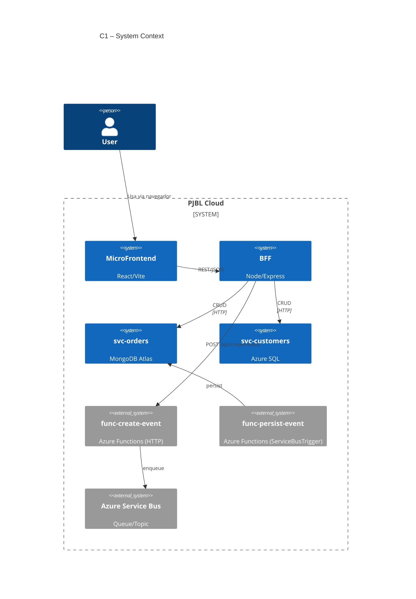
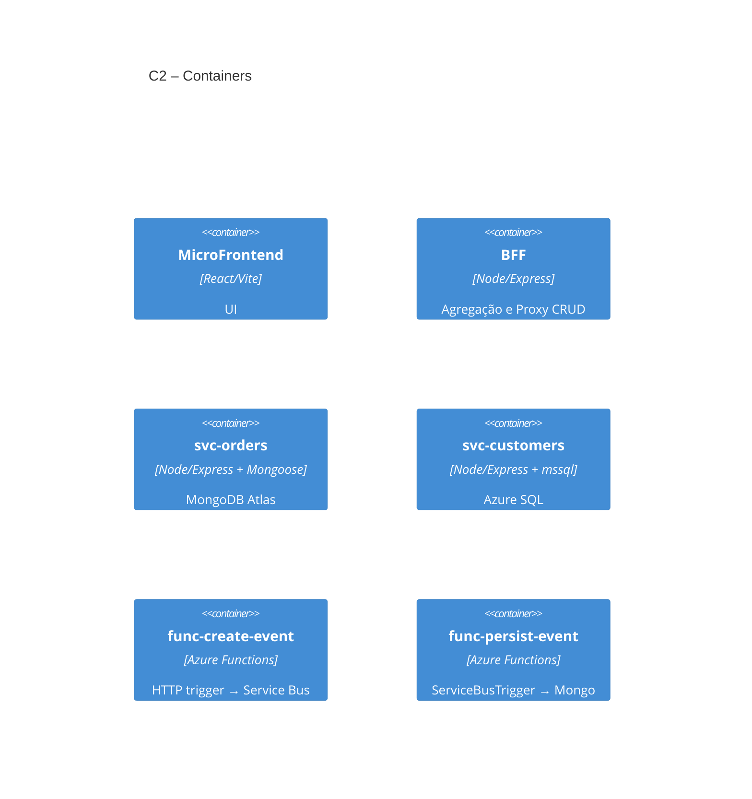
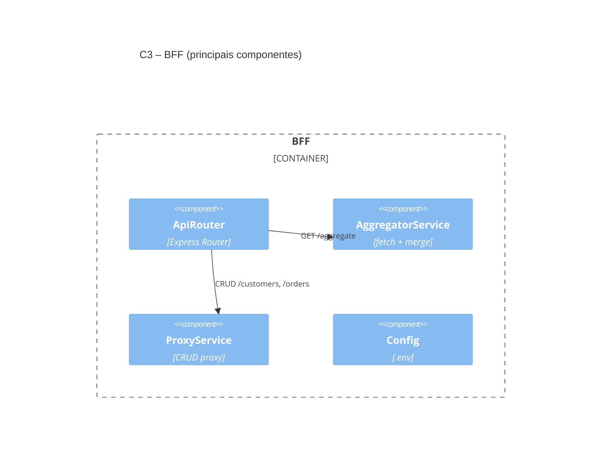

# C4 Model – PJBL Cloud

```mermaid
C4Context
    title C1 – System Context
    Person(user, "User")
    System_Boundary(sys, "PJBL Cloud") {
        System(mfe, "MicroFrontend", "React/Vite")
        System(bff, "BFF", "Node/Express")
        System(orders, "svc-orders", "MongoDB Atlas")
        System(customers, "svc-customers", "Azure SQL")
        System_Ext(funcHttp, "func-create-event", "Azure Functions (HTTP)")
        System_Ext(funcSb, "func-persist-event", "Azure Functions (ServiceBusTrigger)")
        System_Ext(sbus, "Azure Service Bus", "Queue/Topic")
    }
    Rel(user, mfe, "Usa via navegador")
    Rel(mfe, bff, "REST/JSON")
    Rel(bff, customers, "CRUD", "HTTP")
    Rel(bff, orders, "CRUD", "HTTP")
    Rel(bff, funcHttp, "POST /api/create-event")
    Rel(funcHttp, sbus, "enqueue")
    Rel(funcSb, orders, "persist")
```

```mermaid
C4Container
    title C2 – Containers
    Container(mfe, "MicroFrontend", "React/Vite", "UI")
    Container(bff, "BFF", "Node/Express", "Agregação e Proxy CRUD")
    Container(orders, "svc-orders", "Node/Express + Mongoose", "MongoDB Atlas")
    Container(customers, "svc-customers", "Node/Express + mssql", "Azure SQL")
    Container(funcHttp, "func-create-event", "Azure Functions", "HTTP trigger → Service Bus")
    Container(funcSb, "func-persist-event", "Azure Functions", "ServiceBusTrigger → Mongo")
```

```mermaid
C4Component
    title C3 – BFF (principais componentes)
    Container_Boundary(bff, "BFF") {
        Component(api, "ApiRouter", "Express Router")
        Component(agg, "AggregatorService", "fetch + merge")
        Component(proxy, "ProxyService", "CRUD proxy")
        Component(cfg, "Config", ".env")
    }
    Rel(api, agg, "GET /aggregate")
    Rel(api, proxy, "CRUD /customers, /orders")
```
